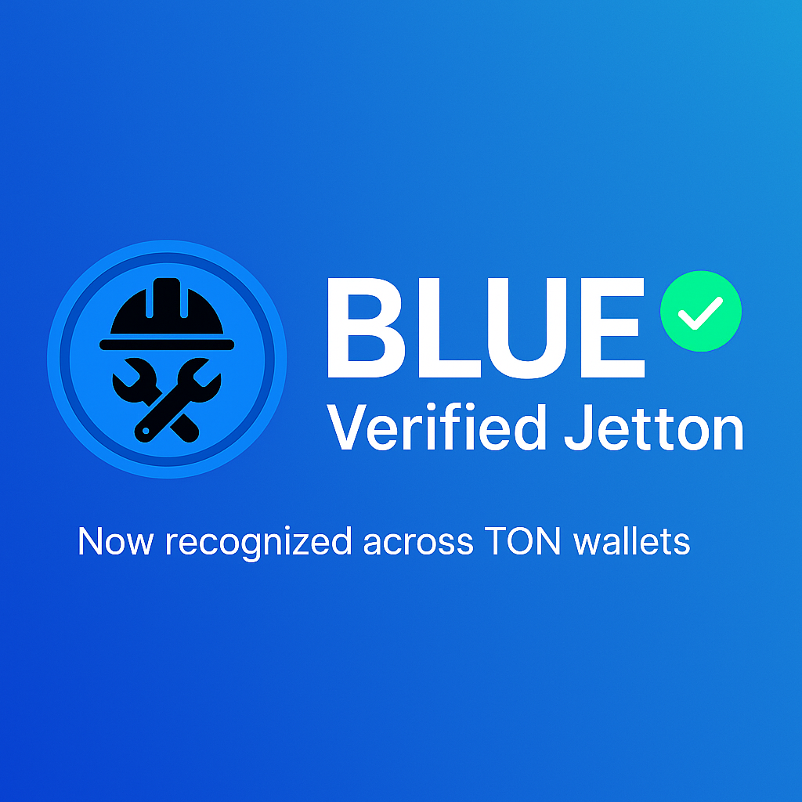

[**Renovation.Reviews**](https://renovation.reviews), the community-driven hub for sharing renovation knowledge, today announced the launch of **$BLUE (Blue Collar Meta)** — a TIP-3 jetton on the **TON** blockchain that turns **verified real-world contributions** into on-chain value.

---

### Tokenomics at a Glance

| Allocation      | Purpose                                                                    | Status                                                        |
|-----------------|----------------------------------------------------------------------------|--------------------------------------------------------------|
| **25 % Burn**   | Permanent reduction of total supply to establish scarcity and enhance long-term value. | Executed on-chain via Jetton burn.                           |
| **50 % Liquidity** | Locked in TON DEX pools to anchor price discovery and guarantee deep, trust-minimised trading. | Deposited and time-locked; viewable on STON.fi.              |
| **25 % Treasury**  | Rewards distribution, community incentives, development and ongoing operations. | Held in a multisig; disbursements governed by on-chain votes. |

*This balanced allocation places half the supply immediately in the market, eliminates one-quarter forever, and reserves the remainder for ecosystem growth.*

---

### Why TON?

* **Telegram-native UX** – Instant wallet creation and token transfers inside the world’s largest messaging platform.  
* **Sub-second finality & micro-fees** – Enables granular rewards for even the smallest verified contribution.  
* **Open Jetton Standard** – BLUE is auto-recognised by wallets, explorers and DEXs; no proprietary integrations required.  
* **On-chain DNS & mini-sites** – Future claim portals and leaderboards can run fully on TON and open directly in Telegram.

---

### Get Involved

1. **Track & trade BLUE** — Price, volume and contract data:  
   <https://dyor.io/token/EQAEWN2gcdaR7Wil9JcELF2VyBuRLVKIMJ99jTxv9Jw8LGjX>  
2. **Provide liquidity** — Add TON + BLUE to the live STON.fi pool and earn a share of swap fees:  
   <https://app.ston.fi/pools/EQB2bgJDmjoVbNqXARgGkVzPanJ_iDu4Oezu29D_e8NPfUQY>  
3. **Earn rewards** — Contribute verifiable knowledge or project outcomes on Renovation.Reviews; once validated, you’ll receive BLUE.  
4. **Join the conversation** — Telegram community: <https://t.me/+SEBp3Pmgpz8zN2Nk>

---

### About $BLUE

**Blue Collar Meta (BLUE)** is a utility-rewards coin on TON that offers rewards for **verified real-world contributions**. Its flexible framework supports a broad range of future use-cases while remaining anchored in transparent, on-chain tokenomics.

---

#### Resources  

* **Website:** <https://builders-toronto.github.io/blue/>  
* **GitHub:** <https://github.com/builders-toronto/blue>  
* **Twitter/X:** <https://x.com/bluecollarmeta>

### Owner and Operator

Daniel Eisenberg – Owner
local@renovation.reviews
